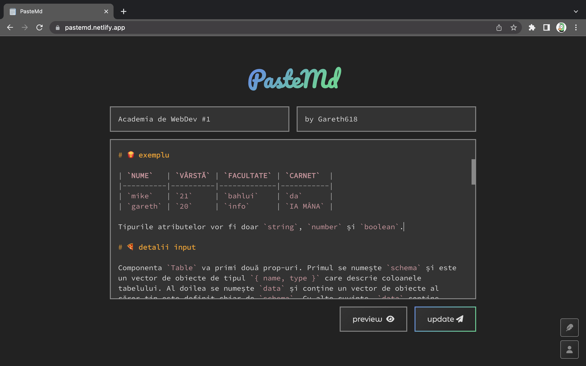
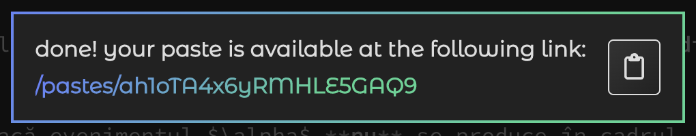
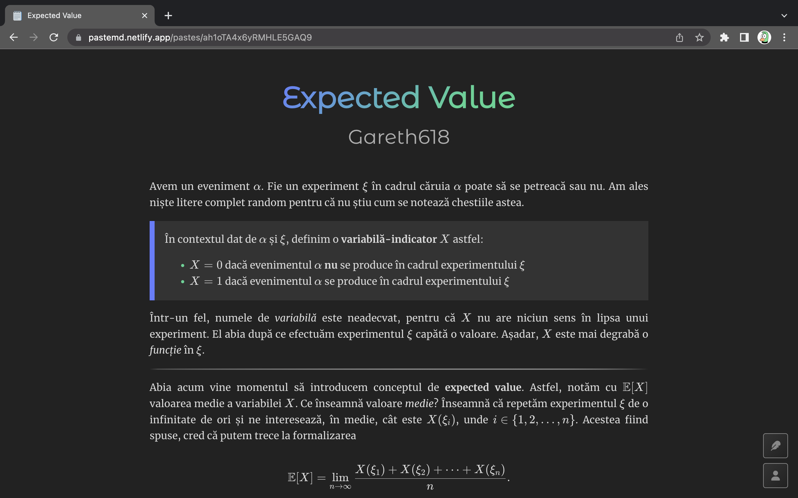
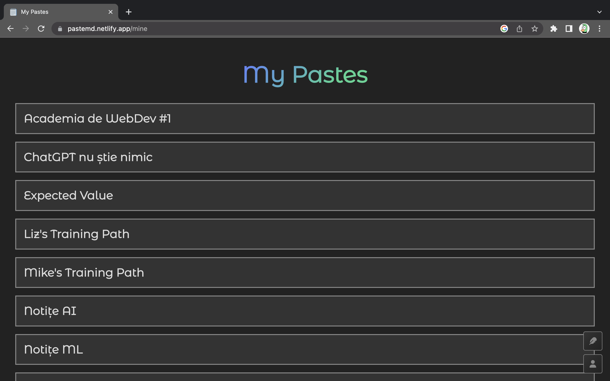

# PasteMd

**PasteBin, but for Markdown files.**
- the website is live [here](https://pastemd.netlify.app/)
- this [paste](https://pastemd.netlify.app/pastes/nMaYWgU0Bdoo4d1RFuoy) is a pretty good demo
- **tech stack:** Vue, Nuxt, FireBase

I decided to make this website in order to centralize and share my Markdown notes with my friends in an easier way. I was also not satisfied with the design provided by VSCode for previewing Markdown files – I had to write some custom CSS every single time I created a new note.

## creating a new paste

You can edit your paste in this beautiful Markdown editor. It has syntax highlighting provided by PrismJS and also supports some keyboard shortcuts, like `ctrl[+shift]+i` for (un)indenting code and auto-closing brackets on selected text. You can preview your paste in a new tab.

And of course you can publish or update it. The first time you hit the _publish_ button, you will be prompted to sign-in with Google in order to be able to communicate with the FireStore database.

## opening the paste

The paste is rendered with this beautiful and minimalistic style. It is optimized for printing and it also supports Twemoji for emojis and KaTeX for rendering mathematical expressions.

At the bottom of the page you will find these three buttons. Here you can edit or delete your paste. And the people you share the link with will be able to give it a heart!

At `/mine` you can find a list of all your pastes.

